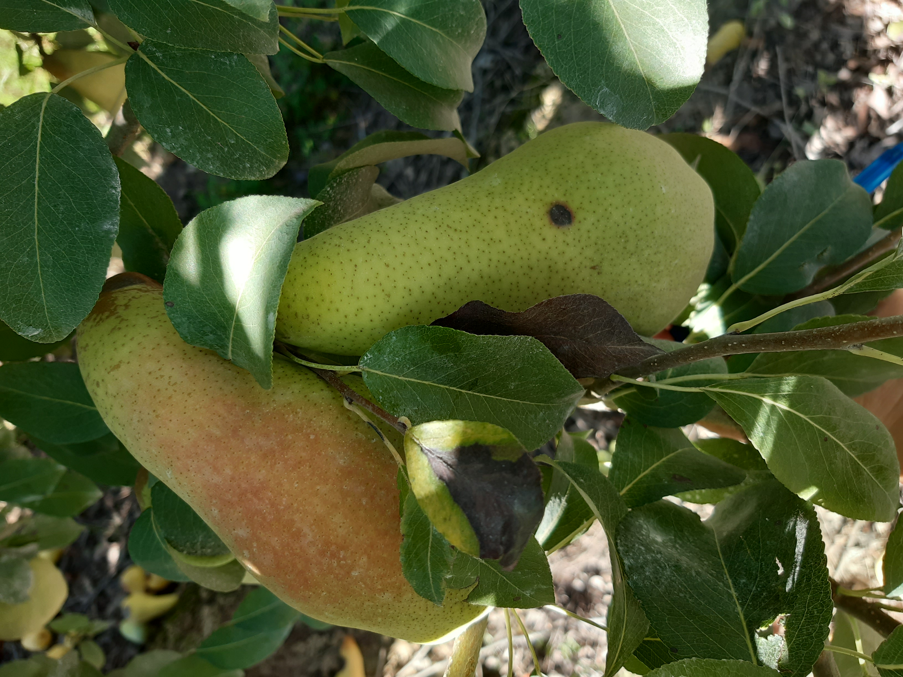

<!-- README.md is generated from README.Rmd. Please edit that file -->

# Efficacy of fungicides against brown spot of pear in Argentina

Authors:Marisa Andrea Aluminé Tudela\*, María Cecilia Lutz, Juan Pablo
Edwards Molina, Gustavo Nestor Giménez, Susana Noemí Di Masi, Graciela
Noemí Pose, Dolores Del Brío.

\*Corresponding autor <tudela.alumine@inta.gob.ar> – ORCID:
0000-0001-8298-8064

**Abstract**

Brown spot of pear (BSP), a fungal disease of importance in Europe, has
been recently detected for the first time in pear orchards in the Alto
Valle of Río Negro (Patagonia), Argentina, South America. The disease is
caused by *Stemphylium vesicarium* and its main symptoms are lesions in
fruits and leaves. To assess counteracting measures against BSP, the
effects of four fungicides were tested to evaluate *in vitro* efficacy
against mycelial growth and spore germination of native *S. vesicarium*
strains, and preventive and curative control of lesion development in
pear fruit ‘D’Anjou’ var. In addition, the activities of two selected
fungicides were determined through in-field assays. The fungicides
tested were chosen according to their commercial availability and
registration in pear crops and included: pyraclostrobin + boscalid
(Bellis®); ziram (Ziram®); captan (Merpan®); and *Melaleuca
alternifolia* extract (Timorex®). Bellis® presented the lowest EC50
values in germination and mycelial growth tests. Ziram® and Merpan® were
also very effective in inhibiting germination. The plant-based
biofungicide Timorex® did not achieve satisfactory effectiveness in in
vitro trials, nor in bioassays after preventive and curative treatments.
Bioassay results showed that preventive measures using Bellis®, Ziram®,
or Merpan® were effective in reducing disease severity and suggested
that BSP could be controlled by adequate selection of treatment time.




For reproducibility purposes of the analysis, this github repository can
be download by:

``` r
usethis::use_course("<https://github.com/juanchiem/Chemical_control_of_brown_spot_of_pear/archive/refs/heads/main.zip>")
```

<!-- badges: start -->
<!-- badges: end -->
